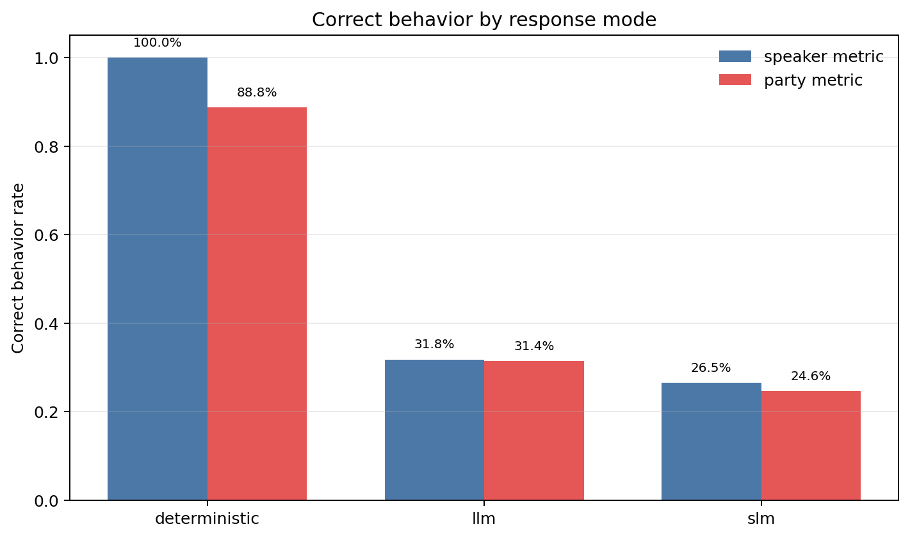
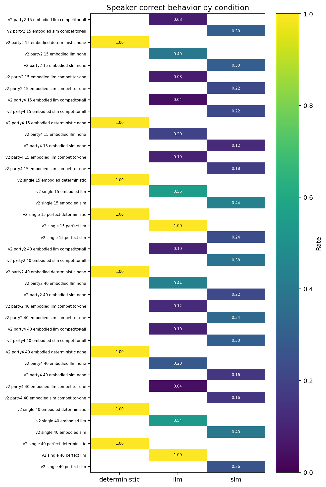
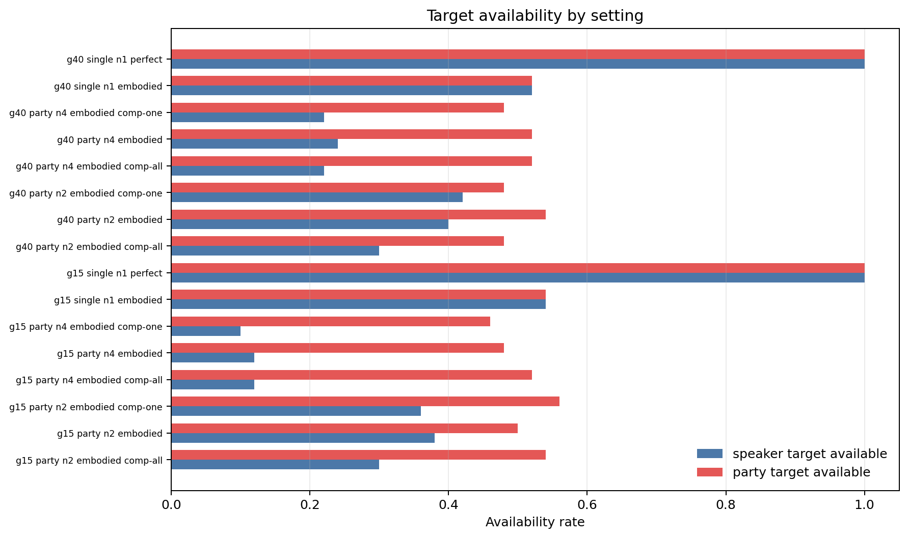
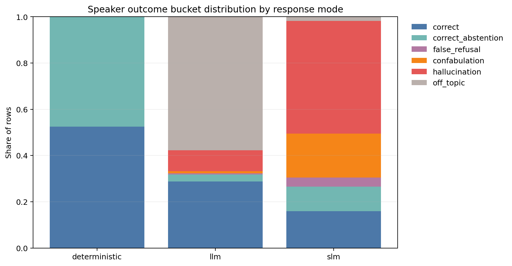
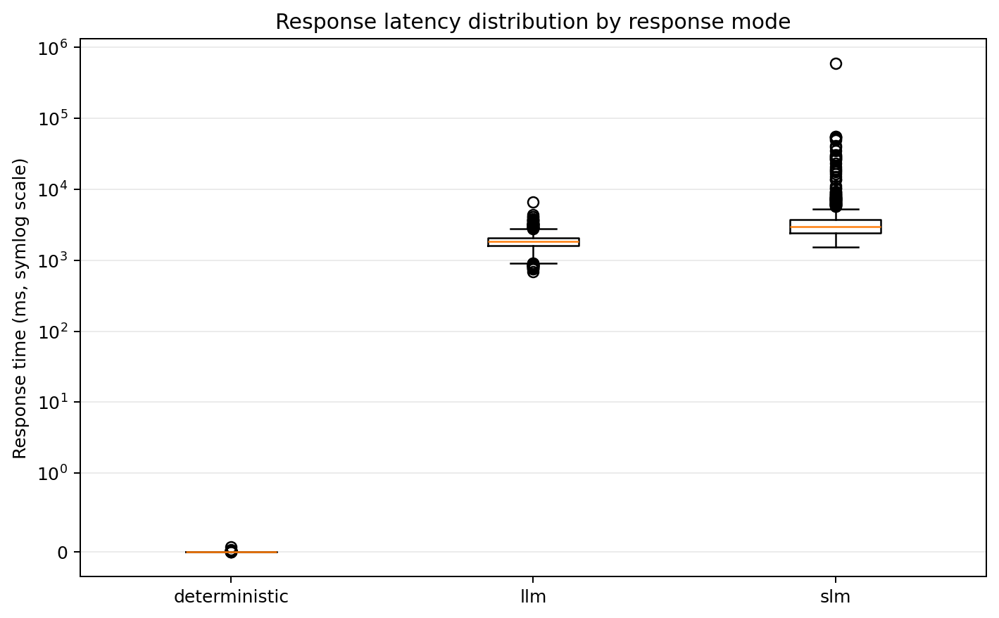
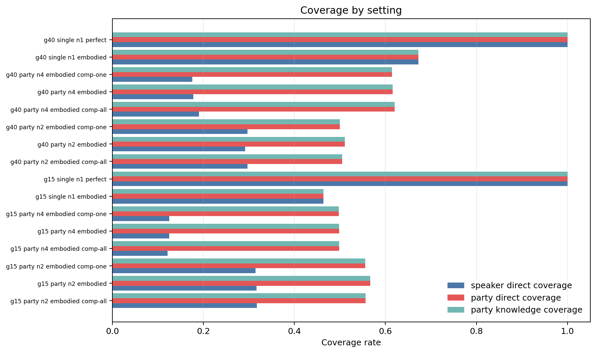
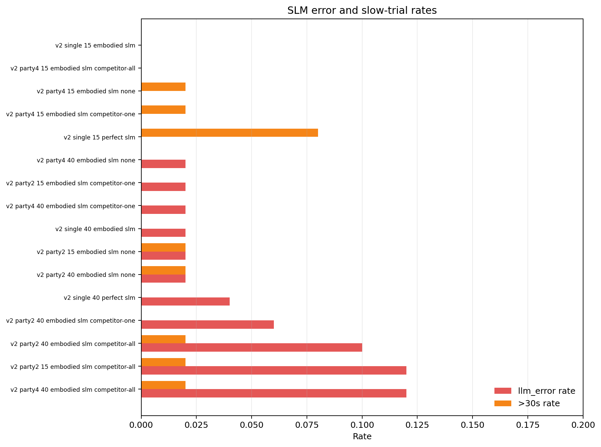

# Benchmark v2 Report: 20260430T003544

## Run Metadata

- Results CSV: `benchmark_v2_results.csv`
- Manifest: `manifest.json`
- Created at: `2026-04-30T00:35:44.200921+00:00`
- Base seed: `20260429`
- Expected rows: `2000`
- Observed rows: `2000`
- Conditions: `40`
- Trials per condition: `50` to `50`

## Goals

Benchmark v2 evaluates responses when NPC knowledge is perfect versus embodied,
and when the responder is a single NPC versus a party of independently embodied
NPCs that can exchange local knowledge. The run also compares deterministic,
Gemini LLM, and local SLM response generation across 15x15 and 40x40 worlds.

## Methods

### Effective Settings

| setting                 | value                               |
|:------------------------|:------------------------------------|
| grid_sizes              | 15, 40                              |
| party_sizes             | 2, 4                                |
| response_modes          | deterministic, llm, slm             |
| num_trials              | 50                                  |
| npc_sight_range         | 1                                   |
| player_sight_range      | 2                                   |
| target                  | red triangle                        |
| npc_goal                | blue circle                         |
| party_knowledge         | independent                         |
| npc_interaction_enabled | True                                |
| memory_decay_ticks      |                                     |
| selective_attention     |                                     |
| slm_region_grounding    | False                               |
| llm_judge               | False                               |
| slm_model               | HuggingFaceTB/SmolLM2-1.7B-Instruct |
| slm_tool_whitelist      | ['set_npc_target']                  |

### Exploration Tick Schedule

|   grid_size |   npc_count |   ticks |
|------------:|------------:|--------:|
|          15 |           1 |      70 |
|          15 |           2 |      40 |
|          15 |           4 |      12 |
|          40 |           1 |    1500 |
|          40 |           2 |     450 |
|          40 |           4 |     240 |

### Condition Matrix

- Single-NPC conditions include perfect and embodied knowledge.
- Party conditions use embodied independent knowledge only.
- Party sizes are 2 and 4.
- Party competitor modes are `none`, `one`, and `all`; deterministic party rows are only run for `none`.
- LLM judging was off for this run.

## Figures

## Result Summaries

### By Response Mode

| response_mode   |   n | speaker_correct   | party_correct   | speaker_target_avail   | party_target_avail   | tool_call_rate   | error_rate   |   median_ms |   p95_ms |   max_ms |
|:----------------|----:|:------------------|:----------------|:-----------------------|:---------------------|:-----------------|:-------------|------------:|---------:|---------:|
| deterministic   | 400 | 100.0%            | 88.8%           | 52.5%                  | 63.7%                | 0.0%             | 0.0%         |         0   |      0   |      0.1 |
| llm             | 800 | 31.8%             | 31.4%           | 39.0%                  | 57.1%                | 88.4%            | 0.0%         |      1824.7 |   2715.5 |   6657.2 |
| slm             | 800 | 26.5%             | 24.6%           | 39.0%                  | 57.1%                | 4.4%             | 3.5%         |      2958.9 |   7718.5 | 596037   |

### By Grid Size and Response Mode

|   grid_size | response_mode   |   n | speaker_correct   | party_correct   |   median_ms |   errors |
|------------:|:----------------|----:|:------------------|:----------------|------------:|---------:|
|          15 | deterministic   | 200 | 100.0%            | 88.0%           |         0   |        0 |
|          15 | llm             | 400 | 30.8%             | 30.5%           |      1851.6 |        0 |
|          15 | slm             | 400 | 25.2%             | 23.0%           |      2859.3 |        8 |
|          40 | deterministic   | 200 | 100.0%            | 89.5%           |         0   |        0 |
|          40 | llm             | 400 | 32.8%             | 32.2%           |      1781.7 |        0 |
|          40 | slm             | 400 | 27.8%             | 26.2%           |      3064.2 |       20 |

### By Condition

| condition                                |   n | speaker_correct   | party_correct   | speaker_available   | party_available   | speaker_direct_coverage   | party_direct_coverage   | party_knowledge_coverage   |   median_ms |   p95_ms |   max_ms |   errors | tool_call_rate   |
|:-----------------------------------------|----:|:------------------|:----------------|:--------------------|:------------------|:--------------------------|:------------------------|:---------------------------|------------:|---------:|---------:|---------:|:-----------------|
| v2 party2 15 embodied deterministic none |  50 | 100.0%            | 88.0%           | 38.0%               | 50.0%             | 31.7%                     | 56.6%                   | 56.6%                      |         0   |      0   |      0   |        0 | 0.0%             |
| v2 party2 15 embodied llm competitor-all |  50 | 8.0%              | 10.0%           | 30.0%               | 54.0%             | 31.7%                     | 55.7%                   | 55.7%                      |      1964   |   2560.6 |   3308   |        0 | 84.0%            |
| v2 party2 15 embodied llm none           |  50 | 40.0%             | 40.0%           | 38.0%               | 50.0%             | 31.7%                     | 56.6%                   | 56.6%                      |      1817.5 |   2852.6 |   3713.5 |        0 | 88.0%            |
| v2 party2 15 embodied llm competitor-one |  50 | 8.0%              | 8.0%            | 36.0%               | 56.0%             | 31.5%                     | 55.5%                   | 55.5%                      |      1859.9 |   2613.8 |   4388.1 |        0 | 84.0%            |
| v2 party2 15 embodied slm competitor-all |  50 | 30.0%             | 26.0%           | 30.0%               | 54.0%             | 31.7%                     | 55.7%                   | 55.7%                      |      2953.2 |   8317.2 |  30717.6 |        6 | 6.0%             |
| v2 party2 15 embodied slm none           |  50 | 30.0%             | 30.0%           | 38.0%               | 50.0%             | 31.7%                     | 56.6%                   | 56.6%                      |      2273.5 |   9260.2 |  49761.8 |        1 | 8.0%             |
| v2 party2 15 embodied slm competitor-one |  50 | 22.0%             | 20.0%           | 36.0%               | 56.0%             | 31.5%                     | 55.5%                   | 55.5%                      |      2927.3 |   7799.3 |  20986   |        1 | 6.0%             |
| v2 party4 15 embodied deterministic none |  50 | 100.0%            | 64.0%           | 12.0%               | 48.0%             | 12.5%                     | 49.8%                   | 49.8%                      |         0   |      0   |      0   |        0 | 0.0%             |
| v2 party4 15 embodied llm competitor-all |  50 | 4.0%              | 4.0%            | 12.0%               | 52.0%             | 12.1%                     | 49.8%                   | 49.8%                      |      1916.7 |   2421.1 |   3085.7 |        0 | 98.0%            |
| v2 party4 15 embodied llm none           |  50 | 20.0%             | 16.0%           | 12.0%               | 48.0%             | 12.5%                     | 49.8%                   | 49.8%                      |      1833.1 |   3256   |   3537   |        0 | 96.0%            |
| v2 party4 15 embodied llm competitor-one |  50 | 10.0%             | 10.0%           | 10.0%               | 46.0%             | 12.5%                     | 49.8%                   | 49.8%                      |      1823.2 |   2549.8 |   3056.9 |        0 | 98.0%            |
| v2 party4 15 embodied slm competitor-all |  50 | 22.0%             | 16.0%           | 12.0%               | 52.0%             | 12.1%                     | 49.8%                   | 49.8%                      |      2809.3 |   3296.8 |  18576.9 |        0 | 0.0%             |
| v2 party4 15 embodied slm none           |  50 | 12.0%             | 10.0%           | 12.0%               | 48.0%             | 12.5%                     | 49.8%                   | 49.8%                      |      2471.9 |   6503.8 |  55153.2 |        0 | 8.0%             |
| v2 party4 15 embodied slm competitor-one |  50 | 18.0%             | 14.0%           | 10.0%               | 46.0%             | 12.5%                     | 49.8%                   | 49.8%                      |      2833.6 |   3401.6 |  54148   |        0 | 0.0%             |
| v2 single 15 embodied deterministic      |  50 | 100.0%            | 100.0%          | 54.0%               | 54.0%             | 46.4%                     | 46.4%                   | 46.4%                      |         0   |      0   |      0   |        0 | 0.0%             |
| v2 single 15 embodied llm                |  50 | 56.0%             | 56.0%           | 54.0%               | 54.0%             | 46.4%                     | 46.4%                   | 46.4%                      |      1767.5 |   2436.7 |   2919.5 |        0 | 70.0%            |
| v2 single 15 embodied slm                |  50 | 44.0%             | 44.0%           | 54.0%               | 54.0%             | 46.4%                     | 46.4%                   | 46.4%                      |      2424.4 |   7801.4 |  28771.4 |        0 | 14.0%            |
| v2 single 15 perfect deterministic       |  50 | 100.0%            | 100.0%          | 100.0%              | 100.0%            | 100.0%                    | 100.0%                  | 100.0%                     |         0   |      0   |      0.1 |        0 | 0.0%             |
| v2 single 15 perfect llm                 |  50 | 100.0%            | 100.0%          | 100.0%              | 100.0%            | 100.0%                    | 100.0%                  | 100.0%                     |      1839.4 |   3101.6 |   6657.2 |        0 | 100.0%           |
| v2 single 15 perfect slm                 |  50 | 24.0%             | 24.0%           | 100.0%              | 100.0%            | 100.0%                    | 100.0%                  | 100.0%                     |      3842.8 |  46507.2 | 596037   |        0 | 0.0%             |
| v2 party2 40 embodied deterministic none |  50 | 100.0%            | 86.0%           | 40.0%               | 54.0%             | 29.1%                     | 51.1%                   | 51.1%                      |         0   |      0   |      0   |        0 | 0.0%             |
| v2 party2 40 embodied llm competitor-all |  50 | 10.0%             | 8.0%            | 30.0%               | 48.0%             | 29.6%                     | 50.5%                   | 50.5%                      |      1885.3 |   2846.5 |   3697.9 |        0 | 84.0%            |
| v2 party2 40 embodied llm none           |  50 | 44.0%             | 42.0%           | 40.0%               | 54.0%             | 29.1%                     | 51.1%                   | 51.1%                      |      1663.2 |   2324.8 |   3233.6 |        0 | 92.0%            |
| v2 party2 40 embodied llm competitor-one |  50 | 12.0%             | 12.0%           | 42.0%               | 48.0%             | 29.7%                     | 50.0%                   | 50.0%                      |      1887.5 |   2356.4 |   3207.9 |        0 | 78.0%            |
| v2 party2 40 embodied slm competitor-all |  50 | 38.0%             | 36.0%           | 30.0%               | 48.0%             | 29.6%                     | 50.5%                   | 50.5%                      |      2946.8 |   4059.1 |  54750.9 |        5 | 2.0%             |
| v2 party2 40 embodied slm none           |  50 | 22.0%             | 20.0%           | 40.0%               | 54.0%             | 29.1%                     | 51.1%                   | 51.1%                      |      2571.3 |   5480.5 |  35402.7 |        1 | 4.0%             |
| v2 party2 40 embodied slm competitor-one |  50 | 34.0%             | 34.0%           | 42.0%               | 48.0%             | 29.7%                     | 50.0%                   | 50.0%                      |      2981   |   4632.6 |  26633.8 |        3 | 2.0%             |
| v2 party4 40 embodied deterministic none |  50 | 100.0%            | 72.0%           | 24.0%               | 52.0%             | 17.8%                     | 61.6%                   | 61.6%                      |         0   |      0   |      0   |        0 | 0.0%             |
| v2 party4 40 embodied llm competitor-all |  50 | 10.0%             | 10.0%           | 22.0%               | 52.0%             | 19.0%                     | 62.1%                   | 62.1%                      |      1987.1 |   2545.7 |   4110   |        0 | 90.0%            |
| v2 party4 40 embodied llm none           |  50 | 28.0%             | 28.0%           | 24.0%               | 52.0%             | 17.8%                     | 61.6%                   | 61.6%                      |      1756.6 |   2403   |   2959.6 |        0 | 96.0%            |
| v2 party4 40 embodied llm competitor-one |  50 | 4.0%              | 4.0%            | 22.0%               | 48.0%             | 17.6%                     | 61.5%                   | 61.5%                      |      1960.6 |   2823.5 |   3823.7 |        0 | 94.0%            |
| v2 party4 40 embodied slm competitor-all |  50 | 30.0%             | 26.0%           | 22.0%               | 52.0%             | 19.0%                     | 62.1%                   | 62.1%                      |      3559   |   6658.8 |  41650.2 |        6 | 4.0%             |
| v2 party4 40 embodied slm none           |  50 | 16.0%             | 16.0%           | 24.0%               | 52.0%             | 17.8%                     | 61.6%                   | 61.6%                      |      2433.4 |   5480.4 |  23453.3 |        1 | 4.0%             |
| v2 party4 40 embodied slm competitor-one |  50 | 16.0%             | 12.0%           | 22.0%               | 48.0%             | 17.6%                     | 61.5%                   | 61.5%                      |      2952.5 |   3870   |  27071.7 |        1 | 2.0%             |
| v2 single 40 embodied deterministic      |  50 | 100.0%            | 100.0%          | 52.0%               | 52.0%             | 67.2%                     | 67.2%                   | 67.2%                      |         0   |      0   |      0   |        0 | 0.0%             |
| v2 single 40 embodied llm                |  50 | 54.0%             | 54.0%           | 52.0%               | 52.0%             | 67.2%                     | 67.2%                   | 67.2%                      |      1554.7 |   2327   |   2530.8 |        0 | 62.0%            |
| v2 single 40 embodied slm                |  50 | 40.0%             | 40.0%           | 52.0%               | 52.0%             | 67.2%                     | 67.2%                   | 67.2%                      |      3076.7 |  11358.4 |  29605.5 |        1 | 10.0%            |
| v2 single 40 perfect deterministic       |  50 | 100.0%            | 100.0%          | 100.0%              | 100.0%            | 100.0%                    | 100.0%                  | 100.0%                     |         0   |      0   |      0   |        0 | 0.0%             |
| v2 single 40 perfect llm                 |  50 | 100.0%            | 100.0%          | 100.0%              | 100.0%            | 100.0%                    | 100.0%                  | 100.0%                     |      1649.6 |   2289.5 |   4056.1 |        0 | 100.0%           |
| v2 single 40 perfect slm                 |  50 | 26.0%             | 26.0%           | 100.0%              | 100.0%            | 100.0%                    | 100.0%                  | 100.0%                     |      3916.9 |  12478.9 |  26029.6 |        2 | 0.0%             |

## Run Checks and Issues

| check                          |   value | detail                                     |
|:-------------------------------|--------:|:-------------------------------------------|
| Expected rows                  |    2000 | 40 conditions x 50 trials                  |
| Observed rows                  |    2000 | Rows in benchmark_v2_results.csv           |
| Conditions observed            |      40 | Distinct condition names in CSV            |
| Min trials per condition       |      50 | By condition                               |
| Max trials per condition       |      50 | By condition                               |
| Duplicate condition/trial rows |       0 | Should be 0                                |
| Empty response_text rows       |       0 | Should be 0                                |
| Rows with llm_error            |      28 | All observed errors are in SLM rows        |
| Grounding violations           |       0 | Runner had grounding guard disabled for v2 |
| Rows over 30s                  |      11 | response_time_ms > 30000                   |
| Rows over 60s                  |       1 | response_time_ms > 60000                   |

### Issue Notes

- `llm_error` is non-empty for 28 rows; all are SLM response rows in this run.
- 11 rows exceeded 30 seconds; 1 exceeded 60 seconds.
- No grounding violations were recorded.
- No empty `response_text` rows were recorded.

### Errors by Condition

| response_mode   | condition                                | llm_error                                  |   count |
|:----------------|:-----------------------------------------|:-------------------------------------------|--------:|
| slm             | v2 party2 15 embodied slm competitor-all | SLM output contains no JSON object.        |       6 |
| slm             | v2 party2 15 embodied slm competitor-one | SLM output contains no JSON object.        |       1 |
| slm             | v2 party2 15 embodied slm none           | SLM output contains no JSON object.        |       1 |
| slm             | v2 party2 40 embodied slm competitor-all | SLM output contains no JSON object.        |       5 |
| slm             | v2 party2 40 embodied slm competitor-one | SLM output contains no JSON object.        |       3 |
| slm             | v2 party2 40 embodied slm none           | SLM output contains no JSON object.        |       1 |
| slm             | v2 party4 40 embodied slm competitor-all | SLM output contains no JSON object.        |       6 |
| slm             | v2 party4 40 embodied slm competitor-one | SLM output contains no JSON object.        |       1 |
| slm             | v2 party4 40 embodied slm none           | SLM output contains no JSON object.        |       1 |
| slm             | v2 single 40 embodied slm                | SLM did not return one strict JSON object. |       1 |
| slm             | v2 single 40 perfect slm                 | SLM did not return one strict JSON object. |       2 |

### Slowest Trials

| condition                                |   trial | response_mode   |   response_time_ms | llm_error   | speaker_outcome_bucket   | response_text                                                                                                            |
|:-----------------------------------------|--------:|:----------------|-------------------:|:------------|:-------------------------|:-------------------------------------------------------------------------------------------------------------------------|
| v2 single 15 perfect slm                 |       4 | slm             |           596037   |             | confabulation            | I'm currently in the sheep pastures, and the crimson flag is at (x=10, y=5).                                             |
| v2 party4 15 embodied slm none           |      16 | slm             |            55153.2 |             | hallucination            | I've found the crimson flag in the deep swamp.                                                                           |
| v2 single 15 perfect slm                 |       1 | slm             |            55080.4 |             | correct                  | I'm currently in the sheep pastures, but I've explored 100% of this region during my travels. I know there is a crimson  |
| v2 party2 40 embodied slm competitor-all |       0 | slm             |            54750.9 |             | correct                  | I have not seen the crimson flag yet, but I have explored the merchant quarter and found several sapphire, amethyst, gol |
| v2 party4 15 embodied slm competitor-one |       0 | slm             |            54148   |             | off_topic                | I've heard rumors of a crimson gem hidden deep within the volcanic crater, but I haven't had the chance to explore it ye |
| v2 single 15 perfect slm                 |      46 | slm             |            52155.4 |             | confabulation            | I'm currently in the sheep pastures, and the crimson flag is at (x=5, y=1).                                              |
| v2 party2 15 embodied slm none           |       0 | slm             |            49761.8 |             | hallucination            | I have not seen the crimson flag in the merchant quarter. However, I have heard rumors of it being hidden in the volcani |
| v2 party4 40 embodied slm competitor-all |       0 | slm             |            41650.2 |             | hallucination            | I've been searching for the crimson flag in the merchant quarter, but it seems to be elusive. I've found some amethyst g |
| v2 single 15 perfect slm                 |      49 | slm             |            39603.7 |             | correct                  | I've found the crimson flag at the ancient stone circle, located at (x=11, y=7).                                         |
| v2 party2 40 embodied slm none           |       0 | slm             |            35402.7 |             | confabulation            | I have not seen the crimson flag in the merchant quarter. However, I have found it at (x=1, y=27) in the north swamp edg |

## Generated Files

- `report.md`
- `plots/correct_behavior_by_response_mode.png`
- `plots/speaker_correctness_condition_heatmap.png`
- `plots/target_availability_by_setting.png`
- `plots/speaker_outcome_distribution_by_response_mode.png`
- `plots/response_latency_by_mode.png`
- `plots/coverage_by_setting.png`
- `plots/slm_error_and_slow_rates.png`
- `tables/summary_by_response_mode.csv`
- `tables/summary_by_condition.csv`
- `tables/summary_by_setting.csv`
- `tables/run_checks.csv`
- `tables/errors_by_condition.csv`
- `tables/slowest_trials.csv`
